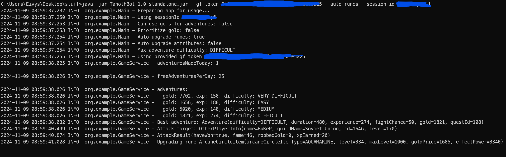
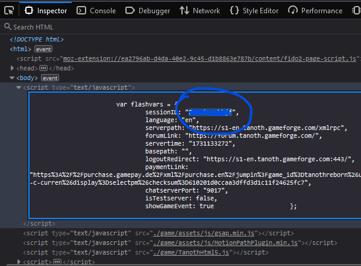
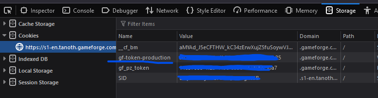

# Tanoth bot

this is a browser game bot, created for fun.


## Features

- Automatically do adventures, prioritizing gold or xp
- Do adventures using gems
- Filter adventures by provided max difficulty
- Automatically refresh session using `gf-token`
- Attack players randomly and then keep re-attacking same one if you win more than 50 gold
- Automatically upgrade runes or one provided rune
- Automatically upgrade attributes or one provided attribute

## Building

use `./gradlew clean build` to create a standalone jar file that will be placed to `build/libs` folder

## Usage

To use the bot you will need to install java version 17+

Usage from terminal:

```
java -jar TanothBot-{version}-standalone.jar --session-id <your-id> --gf-token <your-token> --auto-runes
```

Currently available options:

```
--session-id - <string> Currently active session id, --session-id or --gf-token must be provided
--rune - <string> Rune to upgrade, optional
--attribute - <string> Attribute to upgrade, optional
--use-gems-for-adventures - Use gems when doing adventures, optional
--max-attack-player-level - <int> Maximum player level for attacking randomly. If too low level is selected bot might get stuck in infinite loop on higher positions as it will not find low level players, optional
--gf-token - <string> GameForge token, used to automatically refresh session, --session-id or --gf-token must be provided
--prioritize-gold - Whether to prioritize adventures that give more gold or not, if not will prioritize xp, optional
--auto-runes - Automatically upgrade runes in predefined order so that skull can be upgraded optimally, optional
--auto-attributes - Automatically upgrade attributes in predefined order, optional
--max-difficulty - Set max difficulty of adventures to do, default DIFFICULT, optional
```

## Tokens

### Session ID

Session ID is used to connect to currently existing browser session (will disconnect after some time). It can be found
by logging into the game and inspecting HTML code by pressing F12 and navigating to `Inspector`
or `Elements` tab. sessionID will be in the first script inside `<body>` tag.


### GF token

gf-token is used to get a longer session as it can be used to automatically refresh session-id and keep your connection
for longer periods of time. It is located inside cookies, you can navigate there by pressing F12 and opening `Storage`
or `Application` tab. It will be under `Cookies` sidebar called as `gf-token-production`

